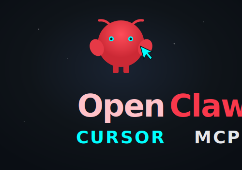

<p align="center">
  
</p>

<p align="center">
  <a href="LICENSE"></a>
  <a href="https://github.com/benjarogit/openclaw-cursor-mcp/releases/latest"></a>
  
  
</p>

<p align="center">
  <a href="https://openclaw.ai/"></a>
  <a href="https://cursor.com/"></a>
  <a href="https://docs.openclaw.ai/cli/mcp"></a>
  
</p>

<p align="center">
  <strong>Sprachen:</strong> <a href="README.md">English</a> · <a href="README.de.md"><strong>Deutsch</strong></a>
</p>

<p align="center">
  <a href="https://openclaw.ai/">OpenClaw</a> mit deinem <strong>Cursor Pro / Pro+ Abo</strong> unter Linux —<br>
  MCP-Anbindung für Cursor IDE · geteiltes Agent-Gedächtnis für Telegram, Terminal &amp; Composer
</p>

---

> **Open Source — frei für alle.** Klonen, nutzen, forken, erweitern — wie du willst.  
> MIT-Lizenz ([LICENSE](LICENSE)) — keine Vendor-Lock-in. Pull Requests und Ideen willkommen.

**Repository:** [github.com/benjarogit/openclaw-cursor-mcp](https://github.com/benjarogit/openclaw-cursor-mcp)

---

## Inhaltsverzeichnis

1. [Was du bekommst](#was-du-bekommst)
2. [Architektur](#architektur)
3. [OpenClaw](#openclaw)
4. [Cursor](#cursor)
5. [MCP (Cursor IDE ↔ Gateway)](#mcp-cursor-ide--gateway)
6. [Geteilter Kontext (SOUL.md, USER.md, …)](#geteilter-kontext-soulmd-usermd-)
7. [Global oder nur ein Projekt?](#global-oder-nur-ein-projekt)
8. [Voraussetzungen](#voraussetzungen)
9. [Installation Schritt für Schritt](#installation-schritt-für-schritt)
10. [Workspace-Dateien](#workspace-dateien)
11. [So nutzt du es im Alltag](#so-nutzt-du-es-im-alltag)
12. [Telegram](#telegram)
13. [Cursor-Nutzungskontingente](#cursor-nutzungskontingente)
14. [Scripts](#scripts)
15. [Fehlerbehebung](#fehlerbehebung)
16. [Sicherheit](#sicherheit)
17. [Links](#links)

---

## Was du bekommst

| Schicht | Funktion | Speicherort |
|---------|----------|-------------|
| **OpenClaw** | Lokaler Agent, Gateway, Kanäle (Telegram, …), Gedächtnis | `~/.openclaw/` |
| **Cursor CLI** | Modell-Backend über dein **Pro / Pro+**-Abo | `cursor-agent` |
| **MCP** | Optionale Tools in Cursor IDE (Chats lesen/senden) | `~/.cursor/mcp.json` |
| **Geteilter Kontext** | Gleiche Persönlichkeit & User-Profil überall | `~/.openclaw/workspace/*.md` + `~/.cursor/rules/` |

**Ergebnis:**

- Am **PC (Cursor):** Composer kennt `SOUL.md`, `USER.md`, `memory/` — wie OpenClaw
- Am **Handy (Telegram):** derselbe Agent, dasselbe Gedächtnis
- Optional: MCP-Tools in Cursor für Gateway-Zugriff

---

## Architektur

```
                    ┌─────────────────────────────────────────┐
                    │  ~/.openclaw/workspace/                  │
                    │  SOUL.md  USER.md  AGENTS.md  TOOLS.md … │
                    └───────────────┬─────────────────────────┘
                                    │
              OpenClaw: automatisch │  Cursor: Rule + Read (Session-Start)
                                    │
          ┌─────────────────────────┼─────────────────────────┐
          ▼                         ▼                         ▼
   Telegram / Kanäle          openclaw chat              Cursor IDE
          │                         │                         │
          └─────────────────────────┼─────────────────────────┘
                                    ▼
                         OpenClaw Gateway (127.0.0.1:18789)
                                    │
                                    ▼ cursor-cli/auto
                              cursor-agent CLI

Cursor IDE ── MCP ──► openclaw mcp serve ──► Gateway
```

**Wichtig:** MCP und geteilter Kontext sind **getrennt**:

- **MCP** = Tools (Chats auflisten, Nachrichten senden). Lädt **nicht** automatisch `SOUL.md`.
- **Geteilter Kontext** = globale Cursor-Rule → liest dieselben `.md`-Dateien wie OpenClaw.

---

## OpenClaw

[OpenClaw](https://openclaw.ai/) ist eine lokale Agent-Plattform: Gateway, Plugins, Kanäle und ein **Workspace** aus Markdown-Dateien.

### Wichtige Pfade

| Pfad | Zweck |
|------|--------|
| `~/.openclaw/openclaw.json` | Hauptkonfiguration |
| `~/.openclaw/workspace/` | Agent-Kontext (SOUL, USER, …) |
| `~/.openclaw/gateway.token` | Lokales Auth-Token (Modus `600`) |
| `~/.npm-global/bin/openclaw` | CLI nach Installation |

Standardmodell in diesem Setup:

```bash
openclaw models set cursor-cli/auto   # Auto + Composer Pool
```

---

## Cursor

[Cursor](https://cursor.com/) ist die IDE; **`cursor-agent`** nutzt dein **Abo**, nicht Pay-per-Token-API.

### Einmal anmelden

```bash
cursor-agent login
cursor-agent about   # Subscription Tier: Pro oder Pro+
```

**Nicht** in `openclaw chat` eingeben — das ist nur Chat, keine Shell.

### Zwei Nutzungs-Pools

| Pool | Verwendung | Dieses Setup |
|------|------------|--------------|
| **Auto + Composer** | Auto, Composer | ✅ `cursor-cli/auto` |
| **API** | Premium-Modelle | ❌ nur bei Bedarf |

On-Demand-Ausgaben in den [Cursor-Einstellungen](https://cursor.com/settings) **deaktiviert** lassen.

---

## MCP (Cursor IDE ↔ Gateway)

[MCP](https://docs.openclaw.ai/cli/mcp) verbindet Cursor IDE mit dem OpenClaw-Gateway.

```bash
bash scripts/setup-mcp.sh
```

Cursor neu starten, MCP-Server `openclaw` aktivieren.

| Tool | Funktion |
|------|----------|
| `conversations_list` | Konversationen auflisten |
| `messages_read` / `messages_send` | Nachrichten lesen/senden |
| `events_poll` / `events_wait` | Live-Events |
| `permissions_list_open` | Offene Freigaben |

Voraussetzung: `openclaw gateway status` → **running**

---

## Geteilter Kontext (SOUL.md, USER.md, …)

OpenClaw und Telegram laden Workspace-Dateien **bei jedem Turn automatisch**. Cursor tut das **nicht von selbst** — dafür gibt es die globale Rule.

### Installation

```bash
bash scripts/setup-cursor-rules.sh
```

Ergebnis: `~/.cursor/rules/openclaw-context.mdc` mit `alwaysApply: true`.

### Was die Rule bewirkt

Bei **jeder neuen Composer-/Agent-Unterhaltung** — **bevor die erste Antwort** kommt — muss der Agent diese Dateien mit dem **Read-Tool** laden (gleiche Reihenfolge wie OpenClaw):

1. `SOUL.md` — Persönlichkeit, Sprache, Grenzen  
2. `USER.md` — Name, Zeitzone, Projekte, Kanäle  
3. `IDENTITY.md` — Agent-Name, Vibe (z. B. CachyClaw 🦞)  
4. `AGENTS.md` — Regeln, Memory, Red Lines  
5. `TOOLS.md` — Setup-Notizen (Gateway, Telegram, Git, …)  
6. `HEARTBEAT.md` — periodische Checks, Nachtruhe  
7. `memory/YYYY-MM-DD.md` — Tagesnotiz (heutiges Datum)  
8. `MEMORY.md` — Langzeitgedächtnis (**nur privat 1:1**)

`BOOTSTRAP.md` wird nach dem Erst-Setup **nicht mehr** verwendet.

### OpenClaw vs. Cursor — ehrlicher Vergleich

| | OpenClaw / Telegram | Cursor Composer |
|--|---------------------|-----------------|
| **Mechanismus** | Dateien werden **injiziert** | Rule verlangt **aktives Lesen** |
| **Wann** | Jeder Turn | Jeder **neuer Chat** (Session-Start) |
| **Inhalt** | Identisch (`~/.openclaw/workspace/`) | Identisch nach dem Lesen |
| **Wirkung** | Kanonischer Kontext | Kanonischer Kontext — **kein optionales „Nice to have“** |

Die Rule sagt explizit: Workspace-Dateien **sind** dein Gedächtnis — nicht nur Referenz.

### Memory wächst mit

- *„Merk dir …“* → `memory/YYYY-MM-DD.md` oder `MEMORY.md`
- Wichtiges kuratiert der Agent später in `MEMORY.md`

Änderungen in Cursor? → passende `.md` in `~/.openclaw/workspace/` aktualisieren, damit Telegram synchron bleibt.

---

## Global oder nur ein Projekt?

**Ja — global für alle Cursor-Projekte.**

| Setup | Geltungsbereich |
|-------|-----------------|
| `~/.cursor/rules/openclaw-context.mdc` | ✅ **Global** — Kodi, WoltLab, alles |
| `.cursor/rules/` im Git-Repo | ❌ Nur dieses Repo |
| `~/.openclaw/workspace/` | ✅ **Global** — alle OpenClaw-Kanäle |
| `~/.cursor/mcp.json` | ✅ **Global** |

Deaktivieren: `rm ~/.cursor/rules/openclaw-context.mdc` → Cursor neu starten.

---

## Voraussetzungen

- Linux (getestet: **CachyOS / Arch**)
- **Node.js** 22.19+
- **Cursor-Abo** (Pro / Pro+ empfohlen)
- **`cursor-agent`:** `curl -fsSL https://cursor.com/install | bash`
- Shell: **fish** oder bash

---

## Installation Schritt für Schritt

```bash
git clone https://github.com/benjarogit/openclaw-cursor-mcp.git
cd openclaw-cursor-mcp

# 1) OpenClaw + cursor-cli Plugin + Gateway
bash scripts/install-openclaw.sh

# 2) Cursor CLI Login (Browser — nicht abbrechen!)
cursor-agent login
cursor-agent about

# 3) MCP: Cursor IDE ↔ Gateway
bash scripts/setup-mcp.sh

# 4) Geteilter Kontext: SOUL.md, USER.md, … in ALLEN Composer-Sessions
bash scripts/setup-cursor-rules.sh

# 5) Optional: KDE Desktop-Verknüpfungen
bash scripts/install-desktop-shortcuts.sh

# 6) Cursor IDE neu starten; MCP-Tools freigeben
```

Diagnose:

```bash
openclaw-cursor-check
```

---

## Workspace-Dateien

Beispiel nach vollständigem Setup (Inhalt individuell anpassen):

| Datei | Typischer Inhalt |
|-------|------------------|
| `IDENTITY.md` | Agent-Name, Emoji, Vibe (z. B. CachyClaw 🦞) |
| `USER.md` | Name, Zeitzone, Projekte, Kanäle (Cursor + Telegram) |
| `SOUL.md` | Sprache, Spezialgebiet, Heartbeat-Regeln |
| `AGENTS.md` | Workspace-Regeln, Memory, Red Lines |
| `TOOLS.md` | Gateway, Telegram-Bot, Git/Release-Regeln |
| `HEARTBEAT.md` | Leichte Checks, Nachtruhe (z. B. 23–8 Uhr) |
| `memory/YYYY-MM-DD.md` | Tagesnotizen |
| `MEMORY.md` | Kuratiertes Langzeitgedächtnis (privat) |
| ~~`BOOTSTRAP.md`~~ | Nach Erst-Setup löschen — nicht mehr nötig |

Alle Dateien liegen unter **`~/.openclaw/workspace/`** — einmal pflegen, überall wirksam.

---

## So nutzt du es im Alltag

### Am PC (Cursor)

Einfach in Composer schreiben — wie bisher. Der Agent lädt beim **Session-Start** `USER.md`, `SOUL.md`, `memory/` (per Rule).

### Am Handy (Telegram)

Bot anschreiben — gleicher Agent, gleiches Gedächtnis (OpenClaw injiziert automatisch).

### Terminal

```bash
openclaw chat       # Chat-TUI
openclaw dashboard  # http://127.0.0.1:18789/
```

### Technisch (läuft im Hintergrund)

- Gateway: systemd, startet mit dem System
- Cursor CLI: Modell-Backend
- Telegram: verbunden (wenn konfiguriert)

---

## Telegram

```bash
openclaw plugins enable telegram
openclaw config set 'plugins.allow' '["cursor-cli","telegram"]'
openclaw channels login telegram
openclaw channels status --probe
```

Gleicher Workspace, gleiches Modell `cursor-cli/auto`.

---

## Cursor-Nutzungskontingente

API-Pool voll, Auto+Composer noch frei?

```bash
openclaw models set cursor-cli/auto
```

Nicht auf Premium-`cursor-cli/*` wechseln, außer du willst API-Kontingent verbrauchen.

---

## Scripts

| Script | Zweck |
|--------|--------|
| `install-openclaw.sh` | OpenClaw, Plugin, Gateway, Modell |
| `setup-mcp.sh` | `~/.cursor/mcp.json` |
| `setup-cursor-rules.sh` | Globale Rule `openclaw-context.mdc` |
| `install-desktop-shortcuts.sh` | KDE `.desktop`-Einträge |

---

## Fehlerbehebung

### Kontext in Cursor spürbar nicht da

1. `ls ~/.cursor/rules/openclaw-context.mdc` — existiert?
2. `bash scripts/setup-cursor-rules.sh` erneut ausführen
3. Cursor **neu starten**, **neuen** Composer-Tab öffnen
4. `ls ~/.openclaw/workspace/SOUL.md`

### `Get Cursor Pro` in OpenClaw

```bash
cursor-agent logout && cursor-agent login
openclaw models set cursor-cli/auto
```

### MCP fehlt in Cursor

Gateway läuft? `~/.cursor/mcp.json` ok? Cursor komplett neu starten.

---

## Sicherheit

- `gateway.token` nie committen (Modus `600`)
- `MEMORY.md` nicht in Gruppen/öffentlich teilen
- cursor-cli nutzt `--force --trust` — nur in vertrauenswürdigen Workspaces

---

## Lizenz & Mitmachen

Dieses Projekt steht unter der **[MIT-Lizenz](LICENSE)**. Du darfst es nutzen, kopieren, ändern, veröffentlichen und weitergeben — privat oder kommerziell — solange der Lizenz-Hinweis erhalten bleibt.

- **Nutzen** — Scripts direkt auf deinem Rechner ausführen  
- **Erweitern** — Configs, Rules und Docs anpassen  
- **Forken** — eigene Variante veröffentlichen  
- **Mitmachen** — Issues und Pull Requests auf [GitHub](https://github.com/benjarogit/openclaw-cursor-mcp)

Keine Garantie — siehe LICENSE. Secrets (`gateway.token`, persönliche `mcp.json`) bleiben nur lokal.

---

## Links

- [OpenClaw Docs](https://docs.openclaw.ai/)
- [Agent Workspace](https://docs.openclaw.ai/concepts/agent-workspace)
- [OpenClaw MCP](https://docs.openclaw.ai/cli/mcp)
- [Cursor CLI](https://cursor.com/docs/cli/overview)
- [Repository](https://github.com/benjarogit/openclaw-cursor-mcp)
